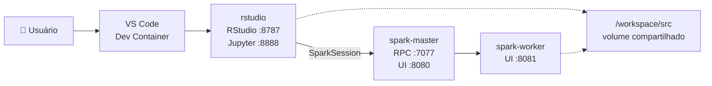
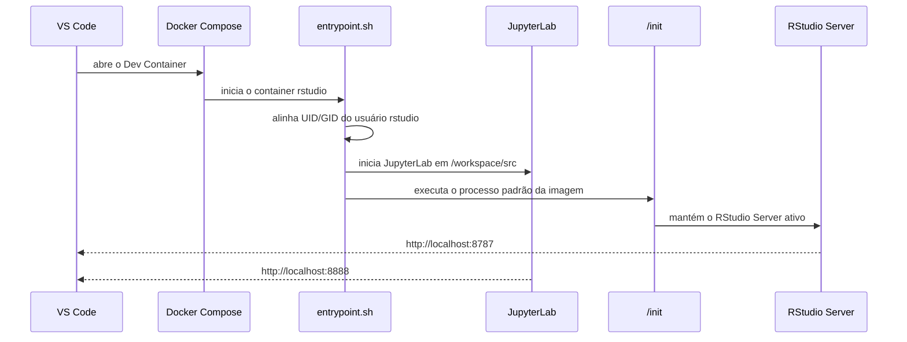
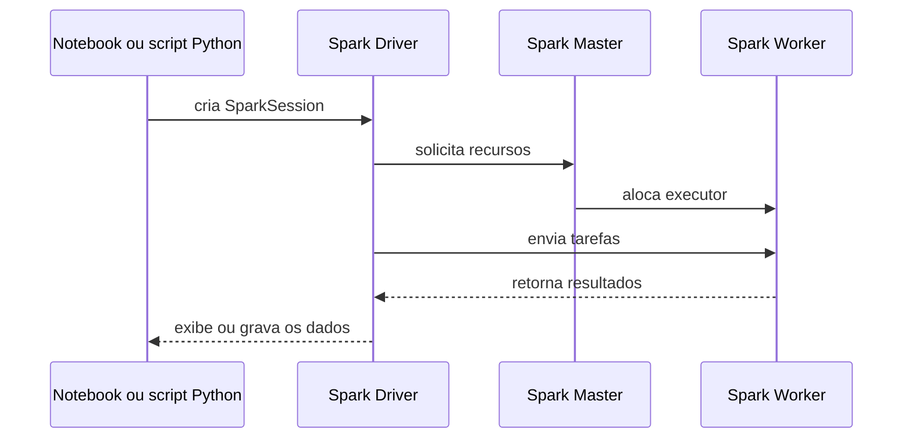

# 🎓 Ciência de Dados e Big Data Analytics

Monorepositório dos estudos, exercícios, notebooks, datasets e projetos desenvolvidos na pós-graduação em Ciência de Dados e Big Data Analytics da Estácio.

O conteúdo está organizado em submódulos Git dentro de [`projects/`](projects/), enquanto os materiais compartilhados ficam em [`src/`](src/).

## Visão geral

- Python, R e SQL para análise e preparação de dados;
- notebooks de análise exploratória, visualização e machine learning;
- Business Analytics, Deep Learning e fundamentos de Big Data;
- execução reprodutível com Docker, VS Code Dev Container, RStudio, JupyterLab e Apache Spark;
- submódulos independentes para cada disciplina do curso.

## Arquitetura do ambiente

O VS Code abre o projeto no Dev Container `rstudio`. Esse container concentra RStudio, Python, JupyterLab e o Spark Driver. O Master e o Worker executam o processamento distribuído na rede Docker `app-network`.



### Dev Container: inicialização

O arquivo [`devcontainer.json`](.devcontainer/devcontainer.json) define o serviço e a pasta `/workspace`. O Compose monta o repositório nesse caminho, e o [`entrypoint.sh`](.devcontainer/entrypoint.sh) ajusta permissões, inicia o JupyterLab em `/workspace/src` e entrega o controle ao processo de inicialização do RStudio.



### Fluxo de uma aplicação PySpark

Dentro da rede Docker, use `spark://spark-master:7077`; `localhost` aponta para o próprio container do cliente e não para o Master.



## Componentes e portas

| Componente | Função | Acesso |
| --- | --- | --- |
| RStudio Server | Desenvolvimento e análise em R | `http://localhost:8787` |
| JupyterLab | Notebooks Python/R e experimentação | `http://localhost:8888` |
| Spark Master | Coordenação do cluster | RPC `7077`, UI `8080` |
| Spark Worker | Execução das tarefas Spark | UI `8081` |
| Hadoop NameNode/DataNode | Serviços de armazenamento configurados no Compose | rede interna |

O ambiente utiliza Python em `/opt/venv`, Apache Spark 3.5.x e Java 17 LTS.

## Estrutura do repositório

```text
.
├── .devcontainer/    # Dockerfile, Compose e entrypoint
├── .github/hooks/    # hooks Git versionados
├── projects/         # submódulos por disciplina
├── src/
│   ├── datasets/     # bases e arquivos de apoio
│   ├── jupyter/      # notebooks
│   ├── python/       # scripts e exemplos Python
│   └── r/            # scripts e projetos R
└── .gitmodules       # configuração dos submódulos
```

## Como iniciar

### Clonar com os submódulos

```bash
git clone --recurse-submodules <url-do-repositorio>
cd prj-pos-estacio-ciencia-dados-big-data-analytics
```

Para uma cópia já existente:

```bash
git submodule update --init --recursive
```

### Abrir no Dev Container

1. Abra a raiz do projeto no VS Code.
2. Execute **Dev Containers: Reopen in Container**.
3. Acesse RStudio em `localhost:8787` ou JupyterLab em `localhost:8888`.

O Compose também pode ser executado manualmente:

```bash
docker compose -f .devcontainer/docker-compose.yml up --build
```

## Submódulos

Cada disciplina possui seu próprio repositório e branch configurada em [`.gitmodules`](.gitmodules). Para atualizar as referências do monorepositório:

```bash
git submodule foreach --recursive git status
git submodule update --remote --merge
git add projects/
git commit -m "chore(deps): atualizar submódulos"
```

## Git Hooks

Para ativar os hooks versionados:

```bash
git config core.hooksPath .github/hooks
```

O hook `post-checkout` ajuda a inicializar e atualizar os submódulos após a troca de branch.

## Objetivo

Manter uma trilha organizada e reproduzível de teoria, prática e projetos em Ciência de Dados, Big Data Analytics, Business Intelligence e Inteligência Artificial.
